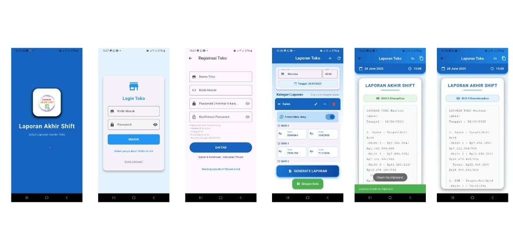
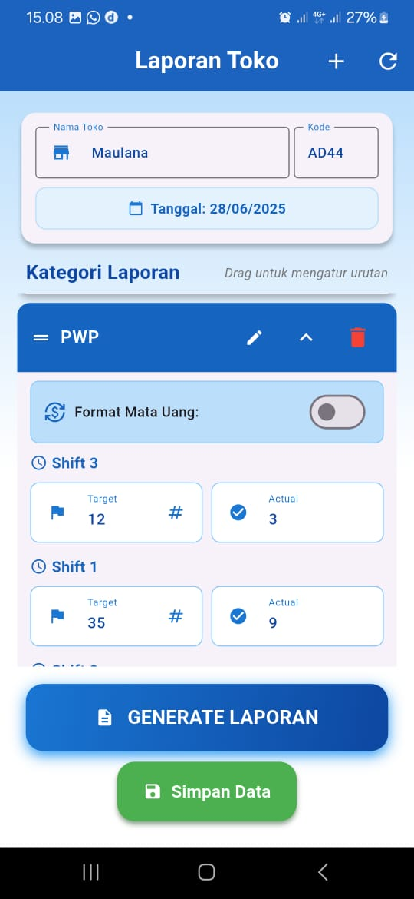
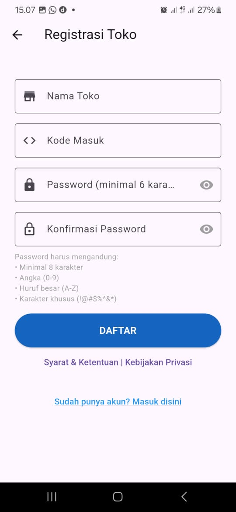
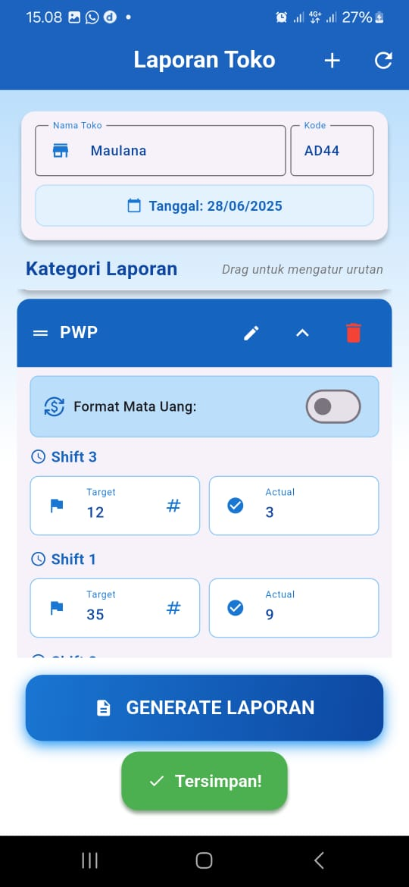
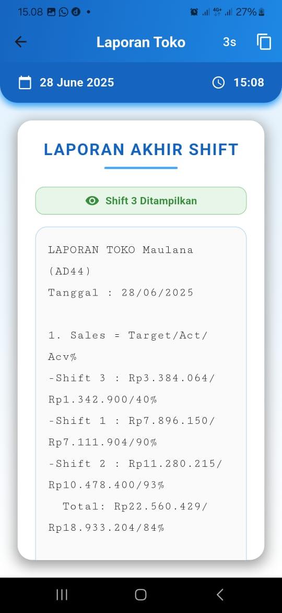
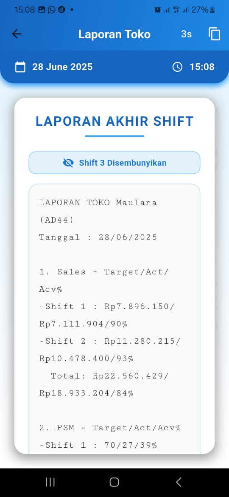
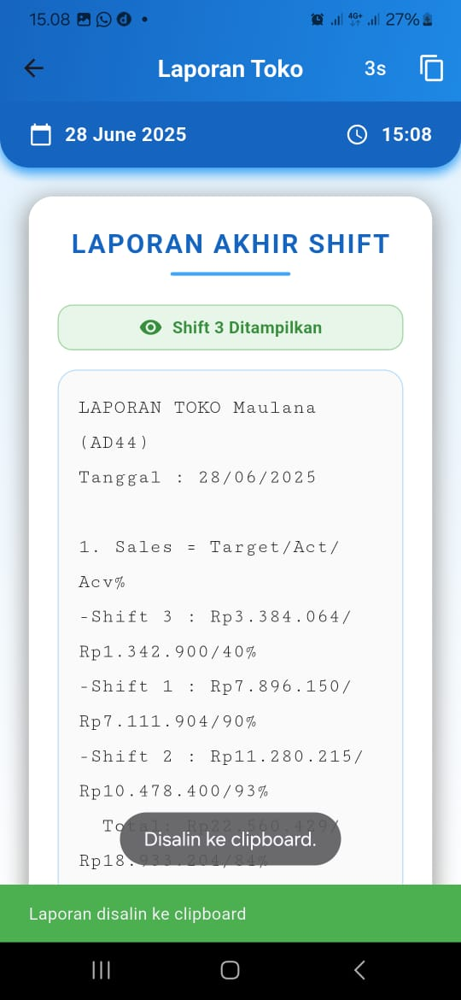
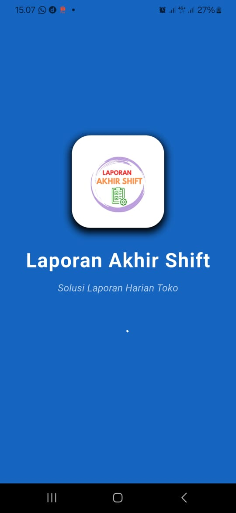
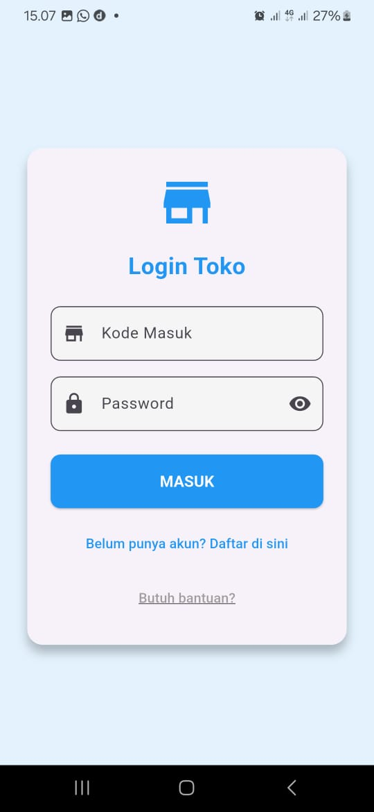

# 🕒 ShiftKu – Laporan Akhir Shift

**ShiftKu** is a modern Flutter application designed to simplify and streamline end-of-shift reporting for employees and team leaders.  
This app enables users to securely log in using **Supabase Authentication** and submit detailed daily reports efficiently.

> **App ID**: `com.andriirv.laporan_akhir_shift`

---

## ✨ Features

- 🔐 **Supabase Auth** — Secure login & registration (email/password)
- 📝 **Shift Report Entry** — Add notes, time, and summaries per shift
- 📊 **Shift Summary Page** — Review submitted shift reports
- 📁 **Modular File Structure** — Easy to read, extend, and maintain
- 📱 **Clean UI/UX** — Minimalist, mobile-first design
- 🚀 Built with **Flutter** for cross-platform performance

---

## 🛠 Tech Stack

- **Flutter** (Dart)
- **Supabase** (Authentication)
- **Provider** (or custom state management)
- **Modular Architecture** for scalability and customization

---

## 📂 Project Structure

lib/
├── category_card.dart          # Kartu kategori laporan
├── help_page.dart              # Halaman bantuan
├── home_page.dart              # Dashboard utama
├── main.dart                   # Entry point Flutter
├── models.dart                 # Data model untuk laporan
├── report_page.dart            # Form laporan akhir shift
├── splash_page.dart            # Halaman splash pertama
├── store_login_page.dart       # Login toko/user
├── store_register_page.dart    # Register akun toko
├── terms_privacy_page.dart     # Terms & privacy policy

---

## 🚀 Getting Started
Clone the repo

Install dependencies

flutter pub get

---

## Run the app
flutter run

---

## 📸 Screenshots

📩 Contact
Have a suggestion or want to collaborate?

📧 Email: irvans2731@gmail.com
🌐 Portfolio: andriirvansyah.vercel.app

If this project helps your workflow, consider giving it a ⭐ on GitHub.
